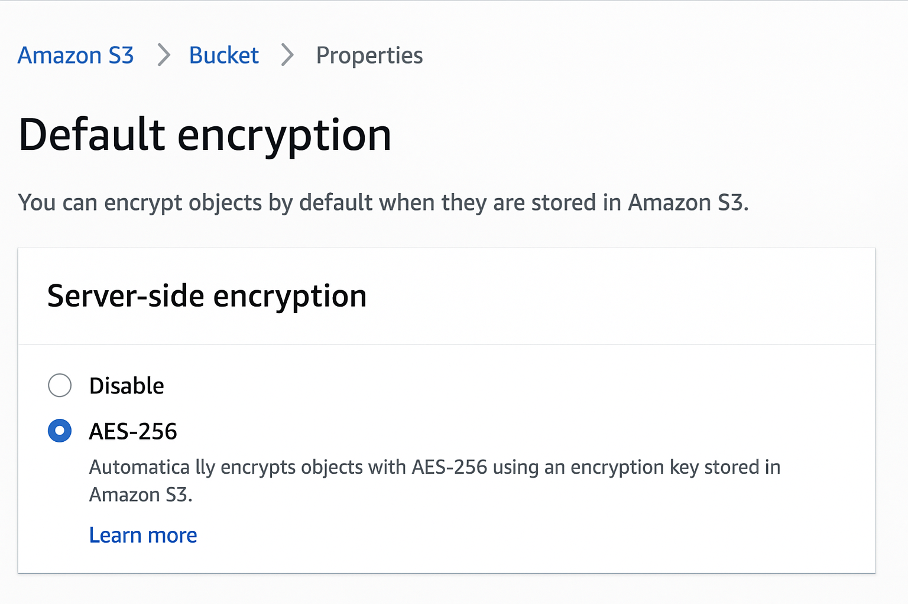
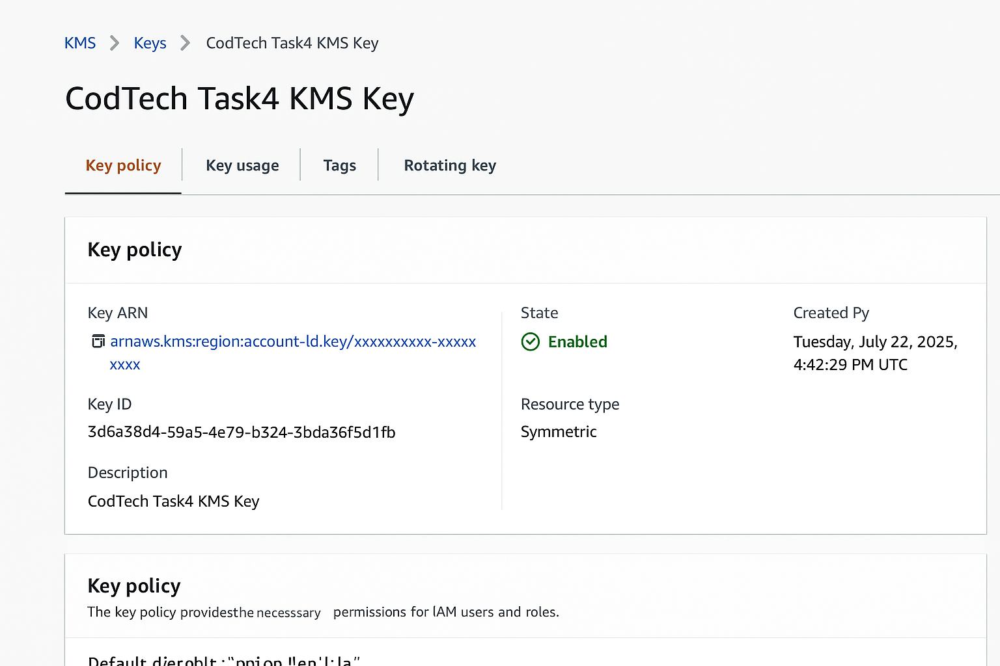
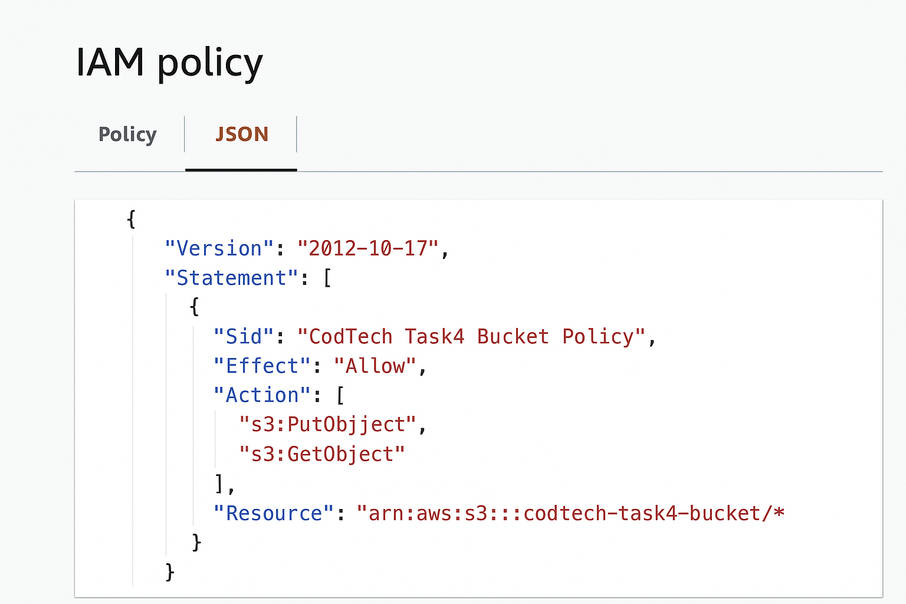
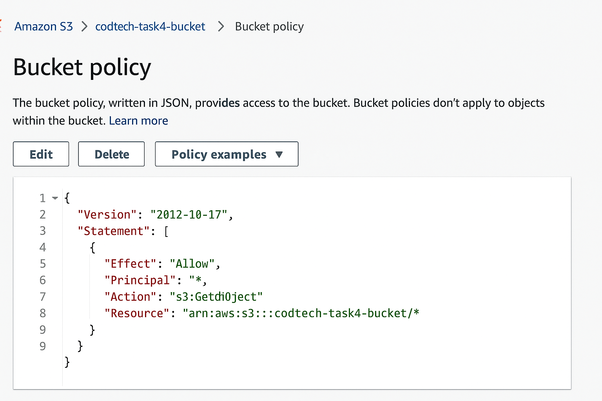
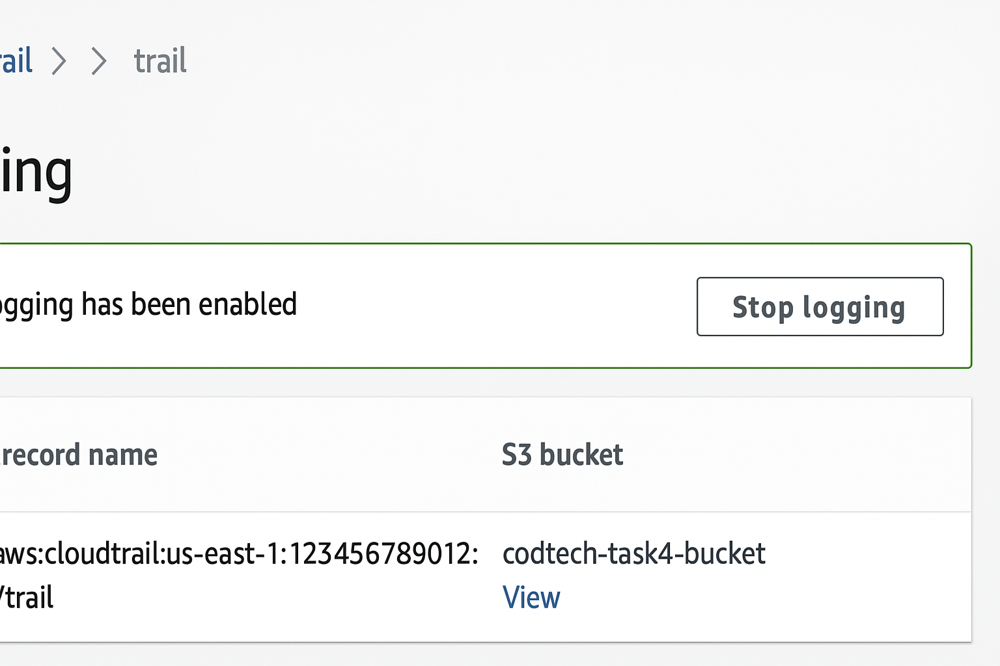

# CodTech Internship – Task 4: Cloud Security Implementation (Simulated)

## ✅ Task Overview
This task demonstrates a simulated cloud security setup focused on secure storage, encryption, and least-privilege access.  
Because billing was unavailable, the setup is simulated but includes real policy files, CLI commands, and screenshot references to showcase the design.

## Scope
- Platforms: **AWS (primary)** and **GCP (secondary)**
- Focus: IAM policies, secure bucket storage, server-side encryption (SSE/CMEK), and access control.

---

## 🔐 AWS — Security Steps (Simulated)
1. Create an S3 bucket (example: `codtech-task4-bucket`).
2. Enable default server-side encryption (SSE-S3) or SSE-KMS.
3. Create an IAM role/user with a policy limited only to that bucket (`iam_policy_aws.json`).
4. Attach a bucket policy to deny public access and enforce TLS (`bucket_policy_aws.json`).
5. Enable S3 access logging and AWS CloudTrail for auditing.
6. Optional: Use pre-signed URLs for short-lived public access.

### AWS CLI Examples:
```bash
aws s3api put-bucket-encryption \
  --bucket codtech-task4-bucket \
  --server-side-encryption-configuration '{"Rules":[{"ApplyServerSideEncryptionByDefault":{"SSEAlgorithm":"AES256"}}]}'

aws kms create-key --description "CodTech Task4 KMS Key"

aws s3api put-bucket-policy --bucket codtech-task4-bucket --policy file://task4/bucket_policy_aws.json
```
---

## 🔐 GCP — Security Steps (Simulated)
1. Create a Cloud Storage bucket: `gs://codtech-task4-bucket`.
2. Apply a CMEK key (from Cloud KMS) or use Google-managed encryption.
3. Create a Service Account with only bucket-level access (`roles/storage.objectAdmin`).
4. Use IAM bindings or conditions to restrict access.

### gcloud Examples:
```bash
gcloud iam service-accounts create codtech-sa --display-name="CodTech SA"

gsutil iam ch serviceAccount:codtech-sa@PROJECT_ID.iam.gserviceaccount.com:objectAdmin gs://codtech-task4-bucket

gsutil kms encryption -k projects/PROJECT_ID/locations/global/keyRings/kr/cryptoKeys/key gs://codtech-task4-bucket
```
---

## 📁 Included Files
- `iam_policy_aws.json` — AWS IAM least-privilege policy example.
- `bucket_policy_aws.json` — Example S3 bucket policy.
- `gcp_iam_bindings.txt` — GCP IAM binding commands and snippets.
- `security_report.md` — Short security design report.

---

### Screenshot Previews

  
  
  
  



---

## ✅ Conclusion
This simulated setup demonstrates secure storage with encryption, strict IAM policies, and audit logging.  
The included policy files and commands can be executed in a real cloud environment when access is available.
